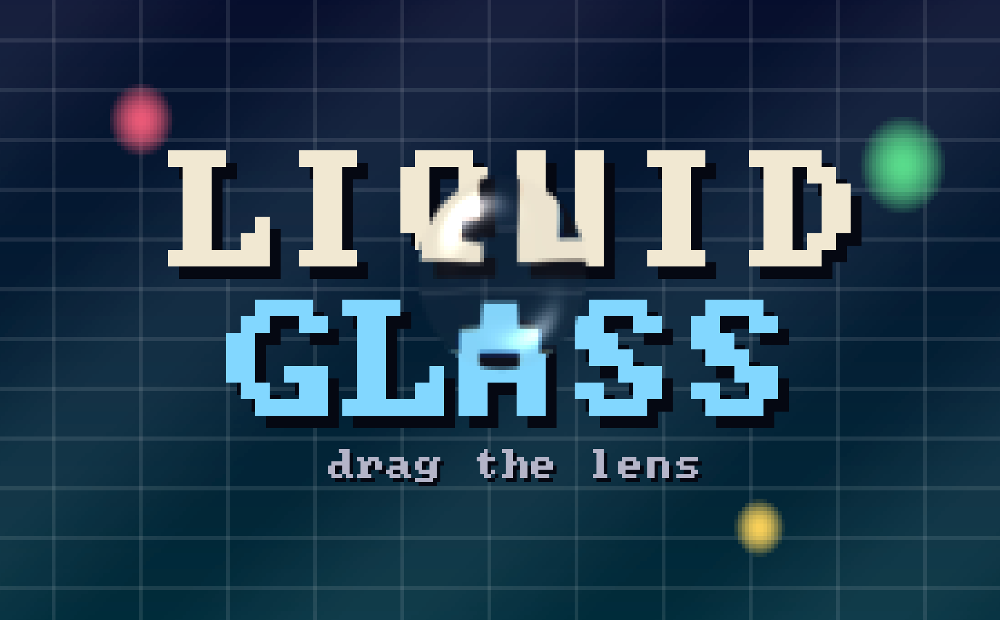
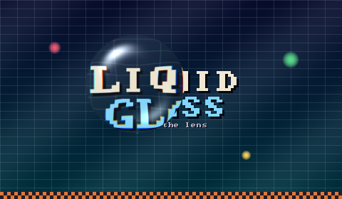

# glasstui

A liquid-glass magnifying lens in your terminal. Big bitmap text and a detailed
backdrop are rendered as RGB "pixels" using half-block characters, and a
draggable glass lens refracts — physically — whatever passes beneath it.



> Tip: zoom your terminal font way out (`Cmd -`) so the canvas has lots of
> pixels; the text is intentionally huge.

## Run

```sh
cargo run --release
```

## Controls

| Input                    | Action                                        |
| ------------------------ | --------------------------------------------- |
| Drag the lens            | Move it around                                |
| **Double-click the lens**| Open / close the settings panel               |
| Scroll wheel             | Resize lens (or adjust selected param)        |
| `↑↓ ←→`                  | Nudge lens / navigate + adjust in settings    |
| Click panel `◀` `▶` / bar| Step or set a parameter directly              |
| `+` / `-`                | Grow / shrink the text                        |
| `r`                      | Reset glass parameters                        |
| `Enter` / `Tab` / `s`    | Toggle settings                               |
| `q` / `Esc` / `Ctrl-C`   | Quit (Esc closes settings first)              |

## How the glass works



The lens follows the same recipe Apple's Liquid Glass material uses:

1. **Shape & height profile** — the lens is a glass slab with a flat top and
   rounded edges: height `h(d)` is 1 inside the `Flatness` fraction of the
   radius, then falls off as a quarter ellipse.
2. **Normals** — the surface normal is derived from the profile's radial
   gradient scaled by `Depth` (the slab thickness in pixels).
3. **Refraction** — a top-down ray is bent through the surface with Snell's
   law (`Distortion` = index of refraction) and traced through the local glass
   thickness; where it lands on the backdrop is what that pixel shows. The
   flat center passes light straight through; the curved rim bends it hard.
4. **Dispersion** — `Chroma` spreads the IOR per color channel, producing
   chromatic aberration that only appears at the edges, like real glass.
5. **Lighting** — Blinn-Phong specular from two lights plus a Fresnel-style
   rim highlight (`Specular`).
6. **Material** — optional `Frost` blur, center `Magnify`, and a brightening
   `Tint`.

All knobs live in [`src/glass.rs`](src/glass.rs) as a `ParamSpec` table; the
settings panel, mouse hit-testing, and scroll-wheel editing are generated from
that table, so adding a parameter is a one-entry change.

## Architecture

| Module             | Responsibility                                              |
| ------------------ | ----------------------------------------------------------- |
| `framebuffer.rs`   | RGB pixel buffer, bilinear sampling, half-block rendering   |
| `bigtext.rs`       | Scaled 8×8 bitmap font (font8x8) text rasterizer            |
| `scene.rs`         | Backdrop: gradient, grid, checkerboard, discs, big text     |
| `glass.rs`         | Lens optics + parameter registry                            |
| `app.rs`           | Input state machine: drag, double-click, settings panel     |
| `ui.rs`            | Frame composition, header, settings popup                   |
| `main.rs`          | Terminal lifecycle and event loop (ratatui + crossterm)     |

Everything below `main.rs`/`ui.rs` is terminal-independent and unit tested.

## Tests

```sh
cargo test                      # 66 unit tests (optics, input, rendering)
python3 scripts/smoke_test.py   # end-to-end pty test of the release binary
cargo run --example snapshot    # render a frame to a PPM image
```
